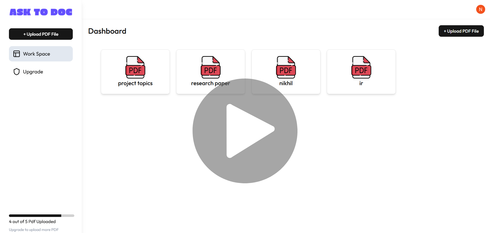

# 📝 Ask To Doc

AI-powered SaaS tool that turns PDFs into **instant answers** with a clean, interactive interface.  
Upload, ask, and get insights from your documents — in seconds.

---

## 🚀 Features

- 📄 Upload PDFs and query them instantly  
- ⚡ AI-powered answers inside a smooth editor  
- 🎨 Beautiful, responsive UI with animations  
- 🔒 Authentication & profile management via Clerk  
- 📱 Mobile-friendly design  

---

## Demo

https://github.com/your-username/your-repo/assets/demo-video.mp4  

*(Click the video to play — hosted in GitHub repo or any public URL)*  

---

## 📸 Preview



---

## 🛠️ Tech Stack

- **Frontend**: Next.js, React, TailwindCSS, Framer Motion  
- **Auth**: Clerk  
- **Backend**: Node.js, Express.js  
- **Database**: MongoDB / Firebase (depending on setup)  
- **Deployment**: Vercel  

---

## ⚡ Getting Started

Clone the repo and install dependencies:

```bash
git clone https://github.com/your-username/ask-to-doc.git
cd ask-to-doc
npm install
